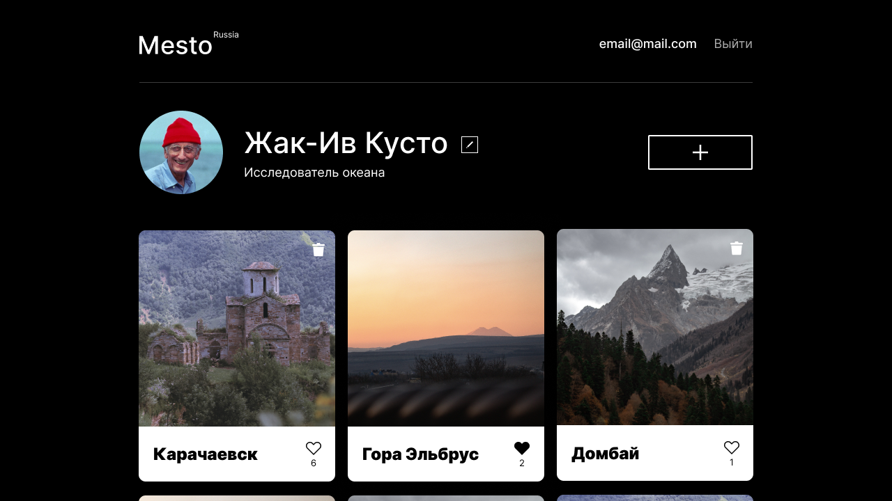

<h1 align="center">Mesto-React (front+back)</h1>


Репозиторий для приложения проекта `Mesto-React`, включающий фронтенд и бэкенд части приложения со следующими возможностями: 
+ **авторизация и регистрация пользователей;**
+ **операции с карточками:**
    + добавление
    + удаление
    + изменение статуса
+ **изменение стутуса и аватара пользователя.**


Бэкенд приложения расположен в директории `backend/`, а фронтенд - в `frontend/`. 



___


### Ссылка на макет:
<a href="https://www.figma.com/file/5H3gsn5lIGPwzBPby9jAOo/JavaScript.-Sprint-12?node-id=4453%3A2&t=XdZyUJ6xxjmUTwvd-0"></a>
___

### Запуск проекта:
1. Клонировать репозиторий
```
git clone https://github.com/greybirbroman/react-mesto-api-full.git
```
2. Установить зависимости
```
1. cd react-mesto-api-full/frontend
2. npm ci
```
3. Запустить проект 
```
npm start
```
___

### Планы по доработке:
+ Провести общий рефакторинг кода с учетом новых знаний библиотеки React;
+ Настроить адаптивность для планшетных и мобильных устройств;
+ Добавить пользователю возможнсть оставлять комментарий к карточке.
  
### Статус: проект сдан 
